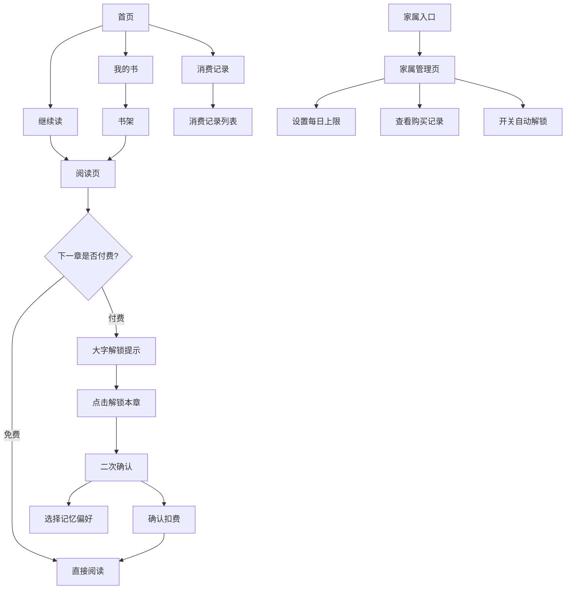

# 银发悦读 - 中老年极简平板阅读器 PRD

## 1. 产品概述

专为中老年小说读者设计的极简平板阅读应用，解决老年人阅读时字小、操作复杂、误触扣费的痛点。
- 大字大按钮、步骤极简、家属代管，让退休人群安心追长篇小说
- 核心价值：消除误扣费焦虑，让阅读回归简单纯粹

## 2. 核心功能

### 2.1 用户角色

| 角色 | 注册方式 | 核心权限 |
|------|----------|----------|
| 读者（老人） | 首次使用自动生成账户 | 阅读小说、解锁章节、查看消费记录 |
| 家属 | 扫码/密码进入家属模式 | 设置消费上限、查看购买记录、关闭自动解锁 |

### 2.2 功能模块

1. **首页**：继续读、我的书、消费记录 三个大按钮
2. **书架页**：已购书籍列表，大字封面与书名
3. **阅读页**：大字正文、左右翻页、章节解锁提示
4. **解锁确认页**：大字价格提示、解锁按钮、记忆选项
5. **消费记录页**：近期购买列表、余额显示
6. **家属管理页**：每日消费上限、购买记录、自动解锁开关

### 2.3 页面详情

| 页面名称 | 模块名称 | 功能描述 |
|----------|----------|----------|
| 首页 | 三大按钮区 | 继续读、我的书、消费记录，按钮超大易点击 |
| 首页 | 余额显示区 | 顶部显示当前书币余额，字体醒目 |
| 书架页 | 书籍列表 | 已购书籍封面+书名，卡片式大尺寸展示 |
| 阅读页 | 正文区域 | 超大号字体（默认24px可调节），行距宽松 |
| 阅读页 | 翻页控制 | 左右两侧点击翻页，底部进度指示 |
| 阅读页 | 解锁提示 | 遇到付费章节时，整页大字提示价格和余额 |
| 解锁确认页 | 价格信息 | "下一章需 X 书币，当前余额 X 书币" 大字展示 |
| 解锁确认页 | 操作按钮 | "解锁本章" 主按钮，尺寸巨大 |
| 解锁确认页 | 记忆选项 | "以后这本书每次都问我" / "超过10书币让家属确认" |
| 消费记录页 | 记录列表 | 按日期分组，显示书名、章节、花费 |
| 家属管理页 | 消费上限设置 | 每日消费上限，可调节滑块+数字 |
| 家属管理页 | 购买记录 | 近期所有购买明细 |
| 家属管理页 | 自动解锁开关 | 一键关闭所有自动解锁功能 |

## 3. 核心流程

### 3.1 阅读流程
读者打开应用 → 首页点击"继续读" → 进入上次阅读位置 → 阅读 → 翻到付费章节 → 显示解锁提示 → 点击解锁 → 确认解锁 → 扣费成功 → 继续阅读

### 3.2 解锁确认流程
遇到付费章节 → 显示大字价格提示 → 用户点击"解锁本章" → 弹出确认框 → 可选择记忆偏好 → 确认后扣费 → 解锁成功

### 3.3 家属管理流程
首页长按或密码进入家属模式 → 查看消费记录 → 设置每日上限 → 开启/关闭自动解锁 → 退出家属模式

## 4. 用户界面设计

### 4.1 设计风格
- **主色调**：暖米色背景 (#FDF6E3) + 深棕色文字 (#3E2723)，护眼舒适
- **强调色**：暖橙色 (#FF8A65) 用于按钮和重要提示
- **按钮风格**：超大圆角、厚实阴影、按压有明显反馈
- **字体**：思源黑体 / 苹方，字重偏粗，默认正文字号 24px
- **布局风格**：卡片式、大留白、元素间距大，减少视觉拥挤
- **图标风格**：简约线性图标，尺寸大，配合文字说明

### 4.2 页面设计概览

| 页面名称 | 模块名称 | UI 元素 |
|----------|----------|---------|
| 首页 | 三大按钮区 | 竖排三个超大按钮，每个占屏幕 1/4 高度，图标+文字 |
| 首页 | 顶部余额区 | 大号字体显示"我的书币：XX"，右侧小字充值入口 |
| 阅读页 | 正文区域 | 上下左右大边距，行距 1.8，段间距明显 |
| 阅读页 | 底部进度条 | 粗线条进度条，显示当前章节进度 |
| 解锁提示页 | 价格区 | 特大号数字显示价格，下方说明余额 |
| 解锁提示页 | 解锁按钮 | 全屏宽度橙色大按钮，文字"解锁本章" |
| 家属管理页 | 开关控件 | 大尺寸开关，配文字说明 |

### 4.3 响应式
- 平板优先设计（横屏 1024px+），适配 7-12 寸平板
- 触控优化：所有可点击元素最小 60x60px，间距 20px 以上
- 支持横竖屏切换，布局自动调整

### 4.4 无障碍设计
- 字体大小可调节（三档：大/很大/特别大）
- 高对比度模式可选
- 所有操作有文字提示，不依赖图标识别
- 关键操作有语音反馈（可选）
