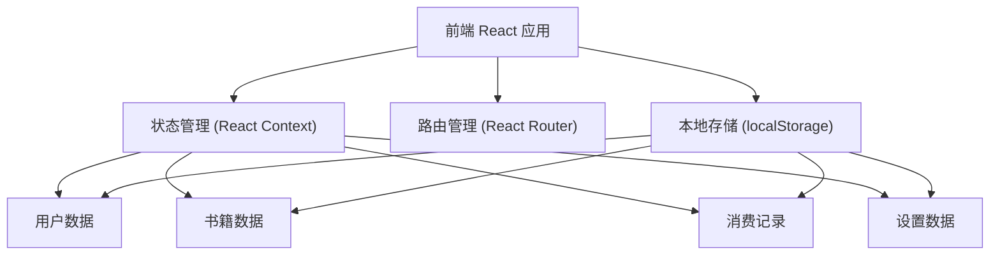

# 银发悦读 - 技术架构文档

## 1. 架构设计



## 2. 技术描述

- **前端框架**: React@18 + TypeScript
- **构建工具**: Vite@5
- **样式方案**: Tailwind CSS@3
- **路由管理**: React Router DOM@6
- **状态管理**: React Context + useReducer
- **数据持久化**: localStorage（模拟后端数据）
- **图标库**: Lucide React
- **后端**: 无（纯前端应用，使用 mock 数据）
- **数据库**: localStorage 存储用户数据

选择纯前端方案的原因：
1. 简化开发，快速验证产品概念
2. 数据本地化，保护用户隐私
3. 适合演示和原型验证
4. 后续可轻松接入真实后端

## 3. 路由定义

| 路由 | 页面 | 说明 |
|------|------|------|
| / | 首页 | 三大按钮入口 |
| /books | 书架页 | 我的书籍列表 |
| /read/:bookId | 阅读页 | 阅读正文 |
| /read/:bookId/chapter/:chapterId | 阅读页-指定章节 |
| /records | 消费记录页 | 购买记录和余额 |
| /family | 家属管理页 | 家属模式入口 |
| /family/verify | 家属验证页 | 密码验证进入家属模式 |

## 4. 数据模型

### 4.1 数据结构定义

```typescript
// 书籍信息
interface Book {
  id: string;
  title: string;
  author: string;
  cover: string;
  description: string;
  totalChapters: number;
  lastReadChapter: number;
  purchasedChapters: number[];
}

// 章节信息
interface Chapter {
  id: number;
  title: string;
  content: string;
  price: number; // 书币，0 表示免费
  isFree: boolean;
}

// 消费记录
interface PurchaseRecord {
  id: string;
  bookId: string;
  bookTitle: string;
  chapterId: number;
  chapterTitle: string;
  price: number;
  timestamp: number;
}

// 用户设置
interface UserSettings {
  fontSize: 'large' | 'xlarge' | 'xxlarge';
  dailyLimit: number; // 每日消费上限（书币）
  autoUnlock: boolean; // 自动解锁开关
  askFamilyAbove: number; // 超过此金额需家属确认
  rememberPerBook: boolean; // 每本书记忆选择
}

// 用户数据
interface UserData {
  balance: number; // 书币余额
  books: Book[];
  records: PurchaseRecord[];
  settings: UserSettings;
  familyPassword: string; // 家属模式密码（默认 1234）
  dailySpent: number; // 今日已消费
  lastSpentDate: string; // 上次消费日期
}
```

### 4.2 Mock 数据

预置 2-3 本示例小说，每本包含 10-20 章内容，部分章节免费，部分章节付费。

## 5. 核心功能模块

### 5.1 阅读模块
- 章节内容渲染（大字、宽行距）
- 翻页逻辑（左右点击/滑动）
- 阅读进度保存
- 付费章节检测与拦截

### 5.2 解锁模块
- 价格展示（大字醒目）
- 余额校验
- 二次确认
- 记忆偏好设置
- 扣费逻辑

### 5.3 家属管理模块
- 密码验证
- 消费记录查看
- 每日上限设置
- 自动解锁开关
- 消费异常提醒

### 5.4 本地存储模块
- 数据持久化（localStorage）
- 每日消费重置（跨天清零）
- 数据初始化与迁移

## 6. 组件设计

### 6.1 通用组件
- `BigButton` - 大按钮组件
- `Card` - 卡片容器
- `Header` - 页面顶部导航
- `Modal` - 弹窗组件（大尺寸）
- `Switch` - 大开关组件
- `ProgressBar` - 粗进度条

### 6.2 页面组件
- `HomePage` - 首页
- `BookshelfPage` - 书架页
- `ReaderPage` - 阅读页
- `UnlockModal` - 解锁确认弹窗
- `RecordsPage` - 消费记录页
- `FamilyPage` - 家属管理页
- `FamilyVerifyPage` - 家属验证页

## 7. 性能与体验优化

1. **大字触控优化**：所有可点击元素最小 60px 高度
2. **过渡动画**：页面切换平滑过渡，不刺眼
3. **护眼模式**：暖色调背景，降低蓝光
4. **响应式布局**：适配不同尺寸平板
5. **离线可用**：纯前端，加载后无需网络
6. **防误触**：关键操作二次确认，按钮间距大
